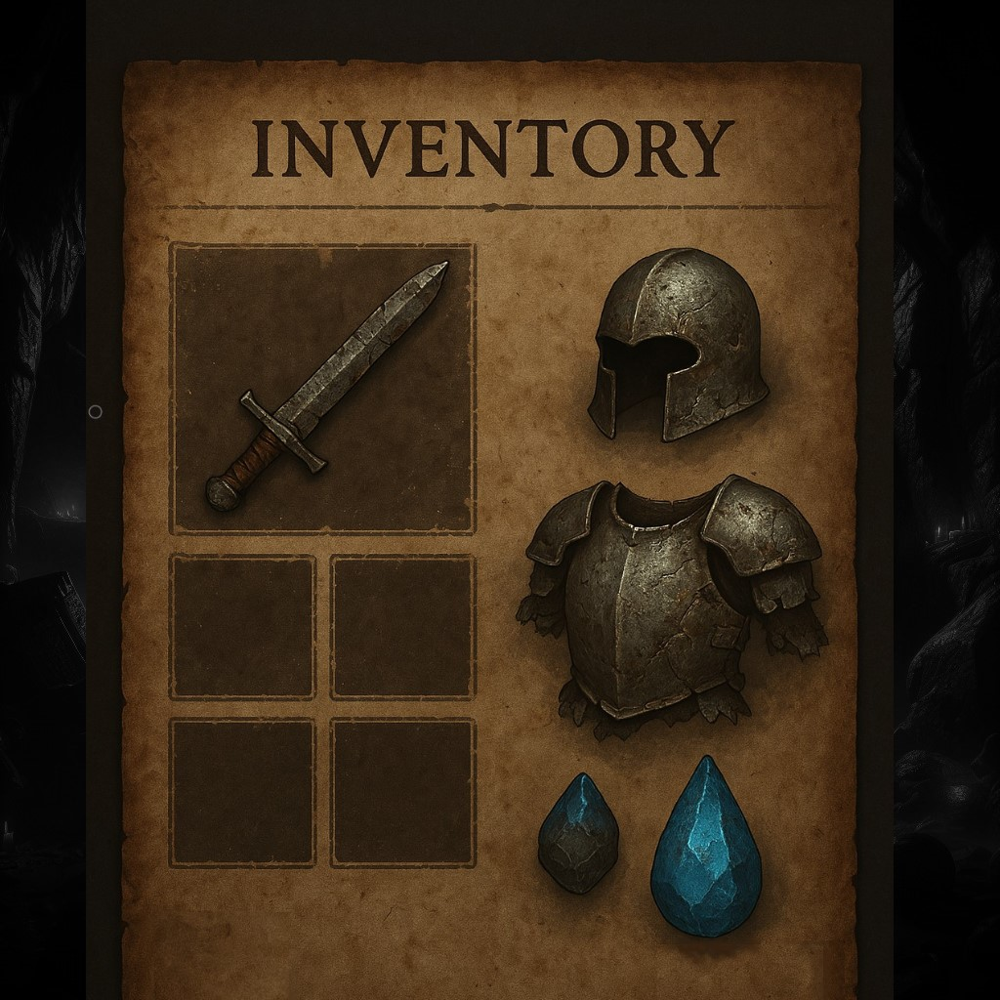

# Dungeon_Crawler_FX
Adventure game made with JavaFX  
> [!NOTE]
> - work in progress - trying to implement creational-patterns
> - rewriting the whole thing now using the fxml-features on branch <a href="https://github.com/Krieger-m/Dungeon_Crawler_FX/tree/fxml-rework"> fxml-rework<a/>

### Preview
      

- more previews will follow

### v_0.2.0.0 (current)
clean-up and some rework  
  
### v_0.1.9.5 
ran into a problem with swapping scenes in a reliable and safe way that does not use lots of performance.   
will take a closer look at how I can solve this one.   
seems to be pretty tricky since I need to learn more stuff and paradigms.  

### v_0.1.9.2 and following
started implementing the SceneFactory   
more clean-up, clean-up, even more clean-up and optimizations.   
ButtonFactory improved and basically also all the other factories :D  

### v_0.1.9.1
further clean-up and still not much functionality...   
only wrestling with the factory-patterns structure  

### v_0.1.6, v_0.1.7, v_0.1.8, v_0.1.9
did a lot of process testing and implementation   
Sandbox was very helpful to optimize functionality   
and de-bloat the code massively.  
  
### v_0.1.4, v_0.1.5
broke the project again and needed to clean up a lot   
also further structural changes   
added a _drop folder to keep the old files for now  
  
### v_0.1.3
button logic added and some more clean-up    
  
### v_0.1.1 & v_0.1.2
broke the project and fixed it... a day of work gone, but   
I took the chance and implemented further structural improvements  
  
### v_0.0.9 & v_0.1.0
button gui-dynamics implemented   
further progress  
  
### v_0.0.8
major color update and further structural developments  
according to the implemented changes  
  
### v_0.0.7
implemented a new structure and try to follow creational design patterns along the process.   
lots of work still to do :)  
  
### v_0.0.6
major changes... still struggling with the scene progression.  
will try a new concept and implement design patterns, next steps:
- factory concept is going to be explored and implemented  
  
