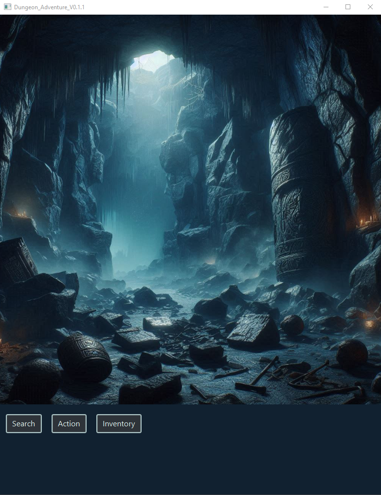

# Dungeon_Crawler_FX
Adventure game made with JavaFX  
work in progress!  
   
### Preview
     
   
- preview of the inventory-screen will follow
   
### v_0.0.6
major changes... still struggling with the scene progression.  
will try a new concept and implement design patterns, next steps:  
- factory concept is going to be explored and implemented  
   
### v_0.0.7
implemented a new structure and try to follow creational design patterns along the process.   
lots of work still to do :)  
   
### v_0.0.8
major color update and further structural developments  
according to the implemented changes  
   
### v_0.0.9 & v_0.1.0
button gui-dynamics implemented   
further progress  
   
### v_0.1.1 & v_0.1.2
broke the project and fixed it... a day of work gone, but   
I took the chance and implemented further structural improvements   
   
### v_0.1.3
button logic added and some more clean-up    
   
### v_0.1.4, v_0.1.5 
broke the project again and needed to clean up a lot   
also further structural changes   
added a _drop folder to keep the old files for now
   
### v_0.1.6, v_0.1.7, v_0.1.8, v_0.1.9
did a lot of process testing and implementation   
Sandbox was very helpful to optimize functionality   
and de-bloat the code massively.  
   
### v_0.1.9.1 (current)
further clean-up and still no functionality...   
only wrestling with the factory-patterns structure   
   
  
